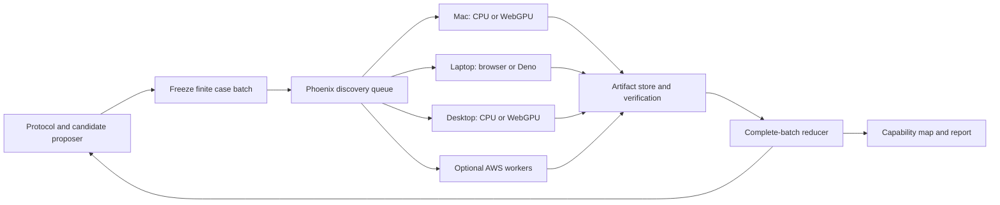

# Technical design

Proposed, 2026-10-04. Builds on the [PRD](/Users/nicholas/develop/browser-life/docs/evolvability-discovery-2026-10-04/PRD.md). Names and commands marked “proposed” do not exist yet.

## Architecture



The feedback arrow exists only during engineering search. Confirmatory evolution runs use a frozen world and protocol. Independent simulations fan out; each world executes entirely on one worker per case. Long histories may later use the existing checkpoint continuation model, after observer continuity is proven.

## 1. Three distinct scientific layers

**Feasibility:** test whether a constructed mechanism can work. **Accessibility:** test viable inherited paths and establishment in a population. **Opportunity:** test whether an acquired capability enables another useful capability. Success in one layer cannot substitute for evidence in another.

Represent a world candidate as `(lawFamily, integerParameters)`. Habitat includes initial matter/free energy, light schedule and spatial layout. Founder panel is a third independent input. Initially vary physical parameters while crossing the same fixed habitats and founders. Do not tune their starting resources together and attribute the outcome entirely to physics.

Existing rule-1 parameter changes are configuration experiments under the existing law. Changes to the equations, genome format, or inherited state need their own versioned law proposal, arithmetic bounds, CPU/WGSL implementation and golden cases. A candidate is immutable once evaluated.

### Cheap feasibility checks

Compute matter and chemical/free-energy budgets, upper bounds on synthesis, unavoidable losses, and quantized transport behavior before expensive histories. Record a certificate for any rejected candidate. An upper bound below a required output can rule out that case under its stated assumptions; failing to construct a witness cannot.

Inspect reaction closure as a structural aid. The present small reaction menu does not justify building a general RAF solver. Energy availability, catalyst dilution and stochastic rounding require dynamic checks even when a reaction cycle exists. Spatial exchange is never replaced with a well-mixed proof without stating the approximation.

### Initial assay contract

Reuse the construction workspace's completed retention witness as a finite-persistence control and its proposed renewal assay as the first capability test, after integrating the necessary reviewed dependencies. Do not silently change or execute that workspace's protocol from this workstream.

| Assay | Proposed measurement | Interpretation |
|---|---|---|
| Finite retention | Paired builder versus cost-retaining transport ablation; B trajectory, paid BUILD flux and material flows | Benefit of this mechanism over the finite window |
| Active renewal | Same source site and at least one fixed additional site maintain B ≥128 at all eleven censuses from step 9,000 through 10,000; local PHOTO+GROW ≥128 and net reaction B ≥0 over that window | Source-preserving activity at additional locations, not autonomous offspring |
| Capacity / density | Frozen spread-zero capacity and divided-inoculum controls | Whether those controls establish support at the tested densities; no conclusion about every moving regime |
| Resource dependence | Matched light-off and passive/no-synthesis controls, separately budgeted during calibration | Distinguishes active production from stored material and persistence artifacts |

For every site, integrated local synthesis is `Q = sum(PHOTO + GROW)`; reaction contribution is `R = B_after_reaction - B_after_transport`, summed each step. Transport contribution is measured separately. Cross-check global B change against synthesis minus RESP, BUILD, starvation and decay. Check matter and the energy ledger exactly. These thresholds come from the proposed renewal plan, not biology; report sensitivity descriptively without changing the registered primary decision.

The reference observer must precompute/copy what it needs before `RefSim.step()` reuses buffers. Packed role counters describe one step and saturate at 16 bits; prove the bound for each allowed configuration or mark it unsupported. Sampling them every 100 steps does not yield an exact integrated flux. CPU execution is initially preferred for this observer; GPU qualification requires exact observation parity and an acceptable measurement cost.

No positive renewal witness is assumed. Handcrafted records validate readout logic but cannot demonstrate the assay's sensitivity in the actual physics. If every physical positive attempt fails, report that limitation and diagnose it before searching for high renewal scores.

### Later assays

Functional heredity needs both transmission and re-expression: track matter-associated genomic transmission, then assay fixed-volume, budget-matched descendants and ancestors in a common garden. Transfers are analytical interventions outside the ecology; they must not be implemented as a reproduction instruction in the physics.

A frozen mutant neighborhood measures viable, neutral, harmful and useful alternatives. Genotype turnover and variant survival are not by themselves selection. Demonstrate differential spread or persistence among coexisting inherited variants, accounting for the possibility of connected populations. Use exact genotype identity and mutation replay where needed; observer lineage IDs are not an adaptive trait.

Test opportunity creation using conditioned environments plus matched reconstruction/removal controls. Preserve material and energy totals when changing a field, and record all transfers. A stronger later test asks whether variant B gains its function because of structure A, and whether A+B enables a predeclared third capability absent from either alone.

For disturbance experiments, randomize independent source populations into calm versus specified stress histories and mutation-on versus mutation-off arms. Mutation-off can select standing variation. Compare source-population cost, extinction, later performance, and inherited common-garden effects; include every assigned population. Withheld challenge transfer is an additional generalization criterion. A stress-benefit claim is bounded to that distribution, duration and outcome; finite experiments cannot prove universal antifragility.

## 2. Discovery loop and evidence separation

Start with a factorial map, then compare a small IMGEP-style archive against matched-budget random search. Published inspiration and limitations are in [RESEARCH.md](/Users/nicholas/develop/browser-life/docs/evolvability-discovery-2026-10-04/RESEARCH.md).

For the proposed search comparison, use two descriptors over the fixed biological founder panel, excluding the ablation arm: worst-habitat finite-persistence fraction and worst-habitat mean number of maintained off-source sites. Finite persistence means the source has B ≥128 at every census in the late window; it does not require the Q/R maintenance tests. Compute each habitat's fraction/mean across the same three founder arms and two seed blocks, then take the minimum across habitats. Map persistence to `[0,1]` and maintained-site count to `[0,4]`, clipping only the display/archive coordinate. Retain untruncated measurements. Use a 4×4 archive with at most two candidates per cell; remove candidates dominated within that cell on the two descriptors, then use canonical candidate ID as a deterministic capacity tie-break. These descriptors reveal a narrow capability space; they are not evidence of open-endedness.

IMGEP proposes a seeded goal in this space, selects a nearest archived candidate, and mutates one allowed parameter to a neighboring registered value. Fall back to uniform sampling before any archive entry exists. Preserve baseline anchors and all failed evaluations outside the archive. The random comparator uses the same allowed space, starting anchors, founder panel, number of case evaluations and seed-block structure. Report worker time as a second budget measure. Proposed search choices must be frozen in machine-readable form before use.

Generate finite batches, await all logical cases, and reduce in canonical case order. Do not update the archive on completion arrival: that would make laptop speed and network interruptions change the search trajectory. Case failure is a technical status; a completed extinction is a scientific outcome. A retry retains the same case identity and random inputs.

Partition inputs into calibration, discovery and confirmation namespaces. Freeze candidate shortlist and all confirmation decisions before evaluating fresh seeds and withheld habitat/founder conditions. A previously inspected control is not “held out.” Existing frozen project observables must not become optimizer descriptors while retaining their old held-out status. Publish exploratory and confirmatory tables separately.

## 3. Case and result contracts

Add a proposed `discovery-v1` task family. Keep legacy `RunSpec` behavior and existing public queue records intact. Use a strict schema with no executable code, arbitrary shell arguments or remote module URLs.

```text
CampaignManifest
  protocolDigest, schemaVersion, buildDigest, sourceClosureDigest
  physicsVersions, observerVersion, readoutVersion
  resolvedParameterDomain, habitats, encodedFounderPanel, assayDefinitions
  seedNamespaces, orderedCaseIds, proposalBatches, archiveDefinition
  resourceLimits, verificationPolicy, stoppingRule

CaseSpec
  campaignDigest, candidateId, habitatId, founderId, assayId
  blockId, armId, physicsSeed, mutationPolicy
  resolvedWorldConfig, initialArtifactDigest, steps, observationSchedule
  requiredBackendContract, resourceClass

ResultManifest
  caseId, attemptId, leaseId, workerId, physicalHostId, backendBuild
  startArtifactDigest, endStateHash, endArtifactDigest
  canonicalObservationDigests, readoutDigest, invariantChecks
  outcome, measuredWallTime, artifactSizes
```

`caseId = SHA256(canonical CaseSpec excluding caseId)`. Its transitive manifest binds the observer, readout, source and limits. Pin the source closure, not only Git HEAD, because dirty jj workspaces are common. Encode typed arrays explicitly as validated hex/arrays. Use finite integers and explicitly encoded wide counters; reject NaN/Infinity and unsafe JS integers. Timestamps and host telemetry live outside canonical scientific payloads.

For optional reuse across campaigns, define a separate evaluation digest over every simulation/observation input and the exact build, excluding only campaign identity and execution telemetry. A cache hit must match this full digest and its verification policy; readouts are reused only if their own version/digest also matches. Associate the original immutable artifact with the new logical case and record provenance rather than rewriting its manifest. A cached discovery observation can never become a fresh held-out replicate.

Seed policy: derive the case table from a frozen master namespace and labels, resolve every seed before submission, check collisions within the experiment and against the known registry, then save the resolved values. Intentionally paired arms share a block/physics seed; do not mix the arm or worker into that seed. Independent blocks must have independent seed domains. Hash derivation alone does not guarantee collision-free u32 seeds; detect collisions and deterministically resolve them before freezing. Never count shared-seed arms, retries, or cross-host replays as independent replicates.

## 4. Coordinator and worker changes

Add an isolated discovery namespace and persistent store in Phoenix. Prefer a small `DiscoveryQueue` and explicit discovery result validator reusing tested artifact and lease primitives where their contracts match. Do not widen legacy preset validation or change existing verification semantics implicitly. Keep heavy hashing, file validation, and reductions outside the single serialized queue process.

Initial jobs are complete small cases, bundled only to amortize network overhead while retaining individual identities. Benchmark a target duration of roughly 30 seconds to 3 minutes on the slowest supported reference host. For longer histories, segment only at physics-step boundaries with observer state included. On lease expiry another worker repeats the case; incomplete output is never a partial scientific result.

Worker states: `joining → qualifying → idle → leased → executing → uploading → acknowledged`, with drain/retry states. On pause, stop accepting new work; finish or abandon the current bounded case according to the displayed policy. Heartbeat failure does not change the simulation seed. A lost completion response is retried idempotently; the server returns the already-accepted identity. A late lease cannot replace a new accepted attempt.

Workers advertise runtime/build, exact rule/observer support, CPU/GPU capability, memory and operator-assigned physical host identity. Qualify using a fixed reference case before assigning research work. The existing rule-capability list alone does not identify an exact research build. Two browser tabs on one Mac are useful transport tests, but not independent physical-host verification.

Use TypeScript CPU workers for small exact assays. Browser WebGPU and Deno WebGPU workers use the same kernel and result contract where qualified. Browser CPU mode should execute in a Web Worker. WASM stays behind this interface if later benchmarking warrants it. A GPU's presence does not imply that it can satisfy per-step observer requirements efficiently.

## 5. Acceptance, aggregation, and persistence

An uploaded case is provisional until the required files, invariants and identity validate. For the initial private campaign, independently replay **every** case and require both canonical observation equality and state/observer equality. Onboarding each new backend also compares to the CPU reference. Later screening may use sampled audits, but shortlist confirmation remains fully replayed and audit coverage is shown explicitly.

Current legacy segment verification does not enforce observation-file agreement. The new discovery acceptance contract does. A digest match alone proves agreement, not correctness of a shared implementation: CPU/GPU differential checks and independent accounting remain necessary. Hardware identity is operator-managed for this private fleet; this is not a Sybil-resistant public-compute design.

Treat execution as at least once, with one accepted result per logical case. Preserve attempted uploads and rejection reasons. Content-addressed bytes are immutable; acceptance is a separately persisted record. Stage bytes, validate them, publish atomically, then durably acknowledge acceptance. Test crash recovery at each boundary. Do not treat a file rename alone as proof of power-loss durability; inspect and test the actual persistence implementation.

The reducer first compares accepted IDs to the manifest's complete expected set. Missing cases yield `incomplete`, mismatches yield `quarantined`, valid complete cases can yield biological extinction. Reduce paired differences within seed blocks; report independent-block counts. Do not silently omit extinct histories or let fast machines dominate the evidence.

Use local content-addressed storage and streamed JSONL/TSV initially. Retain small sufficient statistics for every case; retain full audit inputs/checkpoints and registered trajectories. Bound storage before a campaign. Add an S3 artifact backend only when transfer/storage measurements justify it. Back up the coordinator's acceptance index and artifacts together. No peer-to-peer result merge or shared NFS directory is required.

## 6. Machine joining and cloud use

First deploy a private site/API from one pinned build with a separate data volume. A browser loads the worker page and makes same-origin HTTPS calls. A CLI pulls the same protocol over HTTPS. Workers never need inbound ports or an Erlang cookie. Use private Tailscale HTTPS where available, or the project's approved HTTPS endpoint with research-specific admission and worker credentials. Keep admin credentials off workers and out of URLs.

The proposed CLI is `deno run ... tools/discovery-worker.ts --coordinator URL --backend auto --label NAME --max-minutes 60`. Provide a pinned release launcher after qualification so contributors need not manage source dependencies. This command is a design target, not runnable today. The existing `tools/island.ts` command runs legacy GPU work only.

Start AWS with one bounded worker using the same image and API. Benchmark CPU and GPU on real cases; choose the cheaper accepted throughput. Pin region, image/runtime/build, maximum instance count, lifetime and projected total cost before launch. Use a termination deadline as well as spending alerts: alerts alone are not a hard cap. Include storage/transfer and verification costs. Spot loss is handled by leases and reruns, not by assuming a warning arrives. AWS Batch can later launch the same workers; Phoenix remains the authority for case identity and result acceptance.
