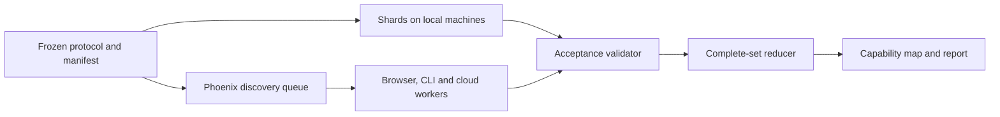

# Technical design

Canonical after council, 2026-10-04, with the user's decisions D1 and D2 applied. Builds on the [PRD](PRD.md). Names and commands marked "proposed" do not exist yet. Paragraphs carried over from the first proposal are unchanged unless the [council record](COUNCIL.md) lists a ruling against them.

## Architecture



One case identity, one validator and one reducer serve both paths. Both are built in Stage 3. The shard path comes first (3a), because the plane wraps its runner, validator and reducer. The Phoenix plane follows directly (3b): the user decided on 2026-10-04 to build it now, so that scientific campaigns fan out across machines. The shard path stays as the reference and the fallback. Independent simulations fan out; each world executes entirely on one machine per case. Long histories may later use the existing checkpoint continuation model, after observer continuity is proven.

Nothing feeds results back into proposals in the first stages: sampling is by frozen factorial. A feedback loop exists only if the optional search comparison is run, and then only during engineering search. Confirmatory evolution runs use a frozen world and protocol.

## 1. Layers and factors

**Feasibility:** test whether a constructed mechanism can work. **Accessibility:** test viable inherited paths and establishment in a population. **Opportunity:** test whether an acquired capability enables another useful capability. Success in one layer cannot substitute for evidence in another.

Five factors are varied separately. A claim about one holds the others fixed and is limited to the panel tested.

| Factor | Examples | Status |
|---|---|---|
| Law | Rule-1 constants such as `kCatHalf`, `diffA`/`diffC`, `spread`, `gateK`, `kPhoto`; the rule version | First map varies rule-1 constants |
| Habitat | Tile size, starting matter and free energy, light mode, seasons, layout | Two reservoir levels in the first map; other habitat axes are hypotheses. A size change during Stage 5 needs its own frozen study, with renewal shown again in the changed habitat |
| Founders | The genome panel | Disclosed panel plus held-out founders in confirmation |
| Mutation supply | `mutRate`, `mutStep` | Off until the selection study |
| Population structure | Tiles, migration, the pond cycle | Evidence from the scaffold line says it matters; not varied before Stage 8 |

Rate constants can change which variants are viable and which opportunities exist, so they are a legitimate first axis. The other factors have prior evidence of changing evolutionary outcomes in this project ([RESEARCH](RESEARCH.md)) and are the candidates for the evolutionary stages. Founder sets are initialization inputs, not config keys, and migration and pond cycling carry compatibility constraints in `validateConfig`.

Represent a world candidate as `(lawFamily, integerParameters)`. Habitat includes initial matter/free energy, light schedule and spatial layout. Founder panel is a third independent input. Initially vary physical parameters while crossing the same fixed habitats and founders. Do not tune their starting resources together and attribute the outcome entirely to physics.

Existing rule-1 parameter changes are configuration experiments under the existing law. Changes to the equations, genome format, or inherited state need their own versioned law proposal, arithmetic bounds, CPU/WGSL implementation and golden cases. A candidate is immutable once evaluated.

### Exact arithmetic before histories

For every candidate, compute and store the transport bands (the smallest amount that leaves a cell, and where the per-neighbour share steps up), the polymer level at which the diffusion gate seals, and the role-counter bounds. [RESEARCH](RESEARCH.md) has the table for the first domains. These are fixtures: each is tested against a passive reference run on an artificial state, not against a copy of its own formula.

A calculation may reject a candidate only when it is a valid integrated bound: it must account for stored inventories, imports, reaction order and the whole state domain, and the certificate is recorded. An upper bound below a required output can rule out that case under its stated assumptions; failing to construct a witness cannot. Expected-value balances, such as the isolated-cell estimate in RESEARCH, are reported as heuristics and never used to reject a candidate, an axis or a descriptor.

The energy inequality in RESEARCH (`10·ΣGROW ≤ E_start − E_end + 8·ΣRESP + 2·ΣDECOMP + net E import`) is the basis for the energy-dependence readout below.

Inspect reaction closure as a structural aid. The present small reaction menu does not justify building a general RAF solver. Energy availability, catalyst dilution and stochastic rounding require dynamic checks even when a reaction cycle exists. Spatial exchange is never replaced with a well-mixed proof without stating the approximation.

## 2. Assays

### Renewal: the primary capability assay

The construction workspace owns this assay: its [renewal plan](../../../browser-life-construction/experiments/construction/RENEWAL-PLAN.md) fixes the thresholds, seeds, selection rule and confirmation gate, and its implementation is the only one. The primary endpoint is not changed by anything in this design. Connected expansion is admissible, an adjacent maintained site counts, and the `spread` 0 rows are transport-disabled diagnostics by intent.

Reuse the construction workspace's completed retention witness as a finite-persistence control and its proposed renewal assay as the first capability test, after integrating the necessary reviewed dependencies. Do not silently change or execute that workspace's protocol from this workstream.

| Assay | Proposed measurement | Interpretation |
|---|---|---|
| Finite retention | Paired builder versus cost-retaining transport ablation; B trajectory, paid BUILD flux and material flows | Benefit of this mechanism over the finite window |
| Active renewal | Same source site and at least one fixed additional site maintain B ≥128 at all eleven censuses from step 9,000 through 10,000; local PHOTO+GROW ≥128 and net reaction B ≥0 over that window | Source-preserving activity at additional locations, not autonomous offspring |
| Capacity / density | Frozen spread-zero capacity and divided-inoculum controls | Whether those controls establish support at the tested densities; no conclusion about every moving regime |
| Resource dependence | Matched light-off and passive/no-synthesis controls, separately budgeted during calibration | Distinguishes active production from stored material and persistence artifacts |

For every site, integrated local synthesis is `Q = sum(PHOTO + GROW)`; reaction contribution is `R = B_after_reaction - B_after_transport`, summed each step. Transport contribution is measured separately. Cross-check global B change against synthesis minus RESP, BUILD, starvation and decay. Check matter and the energy ledger exactly. These thresholds come from the proposed renewal plan, not biology; report sensitivity descriptively without changing the registered primary decision.

The reference observer must precompute/copy what it needs before `RefSim.step()` reuses buffers. Packed role counters describe one step and saturate at 16 bits; prove the bound for each allowed configuration or mark it unsupported. Sampling them every 100 steps does not yield an exact integrated flux. CPU execution is initially preferred for this observer; GPU qualification requires exact observation parity and an acceptable measurement cost.

No positive renewal witness is assumed. Handcrafted records validate readout logic but cannot demonstrate the assay's sensitivity in the actual physics. If every physical positive attempt fails, report that limitation and diagnose it before searching for high renewal scores.

### Secondary readouts

These explain a primary outcome. They never rescue a failed primary gate and never replace it. If the renewal owner wants any of them in the renewal report, they go into that protocol before its freeze; the energy readout in particular needs per-site E accounting that the plan does not yet persist. Otherwise the workbench computes what it can from the stored per-cell records and labels it exploratory.

| Readout | Definition | Why |
|---|---|---|
| Threshold sensitivity | The maintained-site test repeated with the B threshold set to `kCatHalf`, beside the fixed threshold of 128; catalytic efficiency `cat(B)/B` at each | The fixed threshold equals `kCatHalf` only at the anchor. Efficiency at B = 128 runs from 0.80 at `kCatHalf` 32 to 0.20 at 512 |
| Extent | Number of maintained sites; largest Chebyshev distance of a maintained site from the founder; change in the count between an earlier window and the late window, both fixed in the protocol | Separates a two-cell patch from spread |
| Energy dependence | For each maintained site over the window: gross and net E transport, E inventory at start and end, PHOTO, RESP and DECOMP | Dependency measurements, and bounds through the energy inequality. They do not attribute where the energy came from: RESP and DECOMP can release energy from initial or imported matter. Attribution needs chemical-inventory accounting or a controlled intervention. The readout bears on autonomy, which the primary endpoint does not claim |
| Occupancy | Cells with B > 0, cells with B + P > 0, and sites at or above the threshold, reported separately | The threshold cap is not the population |
| Descriptor dependence | After the first map, the joint distribution of the map's descriptors | Decides whether an archive over them would have more than one useful dimension |

### Conditioned-field opportunity test

This asks whether what one strategy leaves behind helps another, which is the second link in the working hypothesis. It has its own protocol and is separate from the construction study's closed, unearned second-opportunity assay. It can run before the map, because it uses the stationary witness and needs no renewable regime.

Two questions need two controls.

| Question | Control |
|---|---|
| Does conditioning, as a whole process, change a receiver's prospects? | Fields conditioned by the builder against fields conditioned by the matched nonbuilder and by the cost-retaining ablation, from identical starting budgets and offered light. Terminal inventories of every channel are reported, because a successful builder may have harvested more light |
| Does the resulting spatial arrangement help at fixed inventories? | A reconstructed field that preserves each channel's total, with a fixed receiver footprint and a reconstruction rule that does not depend on the treatment. It is called reconstructed or scrambled, not unconditioned |

The transfer is an analytical intervention outside the ecology, and it must not smuggle in resources:

- Reserve an identical receiver inoculum inside the declared total budget before conditioning, or debit its matter and energy exactly during reconstruction.
- Never overwrite an occupied cell without accounting for what was removed.
- State whether the living builder remains. If it does, the test is a co-culture. If it is removed, state what becomes of its B, P, E and genome labels.
- Record matter, chemical energy, free energy and signal energy before and after, and any analytical heat or work. Removing P or turning it into A is not energy-neutral unless its energy is reassigned explicitly.
- Place and label the receiver identically in every arm.

Every design includes an inoculum control: the receiver alone at a higher inoculum, with biomass and free energy varied separately where that is possible. In the obligate characterisation, 11 of 12 apparent dependents were rescued by a fourfold inoculum, which raised seeded energy as well as biomass, and one was not. Dependence on another lineage's products was not established there. An apparent dependence here can likewise be an inoculum threshold.

A panel screen is followed by confirmation on fresh seeds. Screening many genomes is not that many independent confirmations. A negative result bounds the panel and the intervention tested. It does not show the second link is impossible, and it does not select a new law. A positive result shows opportunity at the anchor; it does not show that inherited variation can reach it.

### Selection among coexisting variants

This asks whether inherited variants differ in success inside a connected population, without declaring organisms.

1. **Sensitivity first (S11).** In the chosen regime, measure occupied cells, genotype-bearing cells, threshold-qualified sites and the turnover of genome labels. Run a genotype-neutral baseline: one genome under two labels, at both starting ratios. Its spread is the drift and lottery baseline, and it sets the smallest effect the design can detect.
2. **Competition.** Two marked genotypes, mutation off, started at two reciprocal ratios, with their starting positions swapped as a further arm. The readout is the log ratio of genotype-labelled bound mass, split into change from synthesis and change from lottery takeover, because transport relabels a cell's whole content at no cost (`step.ts:311-335`).
3. **What counts.** A direction that follows the genome across the position swap and exceeds the neutral baseline in most independent blocks; or mutual invasion from rare, where each type increases when rare, which is frequency-dependent selection and also counts.
4. **Fixed in advance.** What counts as extinction, how an extinct replicate is scored (it is never dropped), the number of independent blocks, and whether any mutation streams are paired across arms.

A changing genome at a single site is mutation accumulation, not selection.

### Later assays

Functional heredity needs both transmission and re-expression: track matter-associated genomic transmission, then assay fixed-volume, budget-matched descendants and ancestors in a common garden. Transfers are analytical interventions outside the ecology; they must not be implemented as a reproduction instruction in the physics.

A frozen mutant neighborhood measures viable, neutral, harmful and useful alternatives. Genotype turnover and variant survival are not by themselves selection. Demonstrate differential spread or persistence among coexisting inherited variants, accounting for the possibility of connected populations. Use exact genotype identity and mutation replay where needed; observer lineage IDs are not an adaptive trait.

Test opportunity creation using conditioned environments plus matched reconstruction/removal controls. Preserve material and energy totals when changing a field, and record all transfers. A stronger later test asks whether variant B gains its function because of structure A, and whether A+B enables a predeclared third capability absent from either alone.

For disturbance experiments, randomize independent source populations into calm versus specified stress histories and mutation-on versus mutation-off arms. Mutation-off can select standing variation. Compare source-population cost, extinction, later performance, and inherited common-garden effects; include every assigned population. Withheld challenge transfer is an additional generalization criterion. A stress-benefit claim is bounded to that distribution, duration and outcome; finite experiments cannot prove universal antifragility.

Two instruments in this project have separated treatment from a null, and each is reused only within its demonstrated interpretation. The scaffold registration's matched genome control measures a dominant genome's effect on matched ancestral fragments, not inherited improvement in an arbitrary mixed population. The time-shift implant transfers physical contents as well as genomes and has run into extinction floors. Any protocol that uses either says which interpretation it relies on. Disturbance protocols start from the wound screens' recorded results (RESEARCH) and choose their size from the sensitivity analysis, not from the B threshold.

## 3. Sampling, search and evidence separation

**Factorial by default.** A campaign samples a frozen domain by full or fractional factorial, or by seeded random sampling. Its budget is computed from the Stage 3 benchmark, which reports the cost of a primary execution and of a replay separately.

**Enumeration is conditional.** Enumerating a whole domain is allowed when the measured primary cost × cases, plus the measured replay cost × replayed cases, fits the wall-time and storage caps the user set for the campaign. It is not a default.

**A search comparison is optional.** It happens only if the first map shows descriptors with enough distinct, non-collinear values to make coverage meaningful. Its protocol declares which of two things it estimates:

- *Fixed-table performance.* Enumerate once, freeze the algorithms, bins, anchors, proposal budgets, duplicate handling and stopping rules, reveal to each optimizer only the entries it queries, and compare over many independent search seeds. This measures expected coverage on that table. It does not remove the uncertainty from the physics seeds behind each entry, the dependence between entries that share seeds, or the need for validation on unseen founders and habitats. Algorithms and bins must be frozen before the table is inspected.
- *Performance across panels.* Independent tables or simulated campaigns with independent physics seeds. With three campaign blocks this supports a descriptive, practical comparison only; a sign test on three pairs cannot go below p = 0.125.

If the comparison is run, the method is as first proposed:

For the proposed search comparison, use two descriptors over the fixed biological founder panel, excluding the ablation arm: worst-habitat finite-persistence fraction and worst-habitat mean number of maintained off-source sites. Finite persistence means the source has B ≥128 at every census in the late window; it does not require the Q/R maintenance tests. Compute each habitat's fraction/mean across the same three founder arms and two seed blocks, then take the minimum across habitats. Map persistence to `[0,1]` and maintained-site count to `[0,4]`, clipping only the display/archive coordinate. Retain untruncated measurements. Use a 4×4 archive with at most two candidates per cell; remove candidates dominated within that cell on the two descriptors, then use canonical candidate ID as a deterministic capacity tie-break. These descriptors reveal a narrow capability space; they are not evidence of open-endedness.

IMGEP proposes a seeded goal in this space, selects a nearest archived candidate, and mutates one allowed parameter to a neighboring registered value. Fall back to uniform sampling before any archive entry exists. Preserve baseline anchors and all failed evaluations outside the archive. The random comparator uses the same allowed space, starting anchors, founder panel, number of case evaluations and seed-block structure. Report worker time as a second budget measure. Proposed search choices must be frozen in machine-readable form before use.

Two rules apply to every campaign, with or without a search.

Generate finite batches, await all logical cases, and reduce in canonical case order. Do not update the archive on completion arrival: that would make laptop speed and network interruptions change the search trajectory. Case failure is a technical status; a completed extinction is a scientific outcome. A retry retains the same case identity and random inputs.

Partition inputs into calibration, discovery and confirmation namespaces. Freeze candidate shortlist and all confirmation decisions before evaluating fresh seeds and withheld habitat/founder conditions. A previously inspected control is not “held out.” Existing frozen project observables must not become optimizer descriptors while retaining their old held-out status. Publish exploratory and confirmatory tables separately.

**The predictive bridge.** Before the map is used to choose worlds for an evolutionary study, a protocol freezes a prediction and a pass criterion and tests it on new conditions: worlds of high and of low capability, matched for survival and for resources, compared on an evolutionary endpoint read with a validated instrument. The test may run once it is specified, priced and frozen. The map may choose or rank worlds only if the test passes; a failed, invalid or inconclusive test blocks that use and is reported as such. Historical contrasts in the project serve as calibration and as an applicability audit. An observer that cannot run on a world returns "unsupported", which is a missing measurement and not evidence about that world. A feasibility descriptor is not required to order contrasts that differ in habitat or imposed life cycle and share one physics.

## 4. Case and result contracts

Add a proposed `discovery-v1` task family. Keep legacy `RunSpec` behavior and existing public queue records intact. Use a strict schema with no executable code, arbitrary shell arguments or remote module URLs.

```text
CampaignManifest
  protocolDigest, schemaVersion, buildDigest, sourceClosureDigest
  physicsVersions, observerVersion, readoutVersion
  resolvedParameterDomain, habitats, encodedFounderPanel, assayDefinitions
  seedNamespaces, orderedCaseIds, proposalBatches, archiveDefinition
  resourceLimits, verificationPolicy, stoppingRule

CaseSpec
  campaignDigest, candidateId, habitatId, founderId, assayId
  blockId, armId, physicsSeed, mutationPolicy
  resolvedWorldConfig, initialArtifactDigest, steps, observationSchedule
  requiredBackendContract, resourceClass

ResultManifest
  caseId, attemptId, leaseId, workerId, physicalHostId, backendBuild
  startArtifactDigest, endStateHash, endArtifactDigest
  canonicalObservationDigests, readoutDigest, invariantChecks
  outcome, measuredWallTime, artifactSizes
```

`caseId = SHA256(canonical CaseSpec excluding caseId)`. Its transitive manifest binds the observer, readout, source and limits. Pin the source closure, not only Git HEAD, because dirty jj workspaces are common. Encode typed arrays explicitly as validated hex/arrays. Use finite integers and explicitly encoded wide counters; reject NaN/Infinity and unsafe JS integers. Timestamps and host telemetry live outside canonical scientific payloads.

For optional reuse across campaigns, define a separate evaluation digest over every simulation/observation input and the exact build, excluding only campaign identity and execution telemetry. A cache hit must match this full digest and its verification policy; readouts are reused only if their own version/digest also matches. Associate the original immutable artifact with the new logical case and record provenance rather than rewriting its manifest. A cached discovery observation can never become a fresh held-out replicate.

Seed policy: derive the case table from a frozen master namespace and labels, resolve every seed before submission, check collisions within the experiment and against the known registry, then save the resolved values. Intentionally paired arms share a block/physics seed; do not mix the arm or worker into that seed. Independent blocks must have independent seed domains. Hash derivation alone does not guarantee collision-free u32 seeds; detect collisions and deterministically resolve them before freezing. Never count shared-seed arms, retries, or cross-host replays as independent replicates.

Hashing order, to avoid a cycle. `campaignDigest` in a `CaseSpec` is the digest of the campaign core: the manifest with exactly two fields removed, `orderedCaseIds` and `proposalBatches`, which are the only fields in the contract above that hold case IDs. A later schema version that adds another field holding case IDs must add it to this exclusion list. Case IDs are computed against that core. The manifest digest is then the hash of the completed manifest, core and case list together, and it is what the acceptance index and the export bind to.

Canonical bytes are UTF-8 JSON with object keys sorted recursively and no insignificant whitespace, the form `canonicalObserverJSON` in `packages/schema/src/accounting.ts` already produces. Integers that fit a JavaScript safe integer are JSON numbers. Counters that can exceed that range are base-10 strings without leading zeros. A typed array is a lowercase hex string of its bytes, each element little-endian at the width its schema field declares, so `Uint32Array([1])` is `"01000000"`. Stage 3 ships shared test vectors for the core digest, a case ID and the manifest digest, including a typed array and a wide counter, so that a second implementation can check itself.

Paired streams stay available where they reduce variance. A protocol with mutation on states its inferential unit, and whether mutation draws are paired across arms: mutation draws are keyed on seed, step and cell (`step.ts:502-514`), so arms that share a seed share them.

## 5. Local execution

The first executor needs no service. All names below are proposed.

```text
deno run -A tools/discovery.ts freeze   --protocol experiments/discovery/<campaign>/protocol.json --out runs/discovery/<campaign>
deno run -A tools/discovery.ts run      --root runs/discovery/<campaign> --shard 0/2 --host <label>
deno run -A tools/discovery.ts replay   --root runs/discovery/<campaign> --shard 1/2 --host <label>
deno run -A tools/discovery.ts validate --root runs/discovery/<campaign>
deno run -A tools/discovery.ts reduce   --root runs/discovery/<campaign>
```

- **Freeze** resolves every `CaseSpec`, checks seed collisions, writes the initial-state artifacts and the manifest with its source-closure digest, and executes zero simulation steps. It requires an exclusive new root.
- **Run** takes the cases whose position in `orderedCaseIds` falls in its shard. It refuses to start if the source closure of the running code differs from the manifest's. Each attempt is written under a temporary name inside `cases/<caseId>/attempts/` and renamed when complete. An attempt is never overwritten. Before skipping a case that already has a result, the runner validates that result; a directory's existence is not acceptance.
- **Replay** writes to `replays/<caseId>/<host>/`. The first campaigns replay every case on a different physical host.
- **Collection** is a directory copy. Attempt names include the host label, so results from two machines cannot overwrite each other.
- **Validate** applies the acceptance rules in section 7 and writes the acceptance index as a separately persisted record. A mismatch quarantines the case and keeps both attempts.
- **Reduce** reads the acceptance index, compares it with the manifest's ordered set, and reports incomplete, quarantined or complete. It reduces in canonical order.

Research output lives under `runs/discovery/` and never in the coordinator's data directory, so a research case cannot enter a registered or public queue. This path demonstrates two hosts, exact identity, validated reuse and complete-set reduction. It does not demonstrate leases, coordinator restart, late uploads or browser onboarding; the plane demonstrates those in Stage 3b.

The CPU case runner reuses the reviewed renewal observer through a stable API. It does not contain a second observer. Until Stage 1 delivers that observer, the runner is exercised on the engineering campaign with observers already in `main`, through the same interface.

## 6. The distributed plane

Built in Stage 3b, directly after the local core (decision D1). The design is the first proposal's and is unchanged. It adds transport and a worker interface around the same runner, validator and reducer; it does not put research jobs on the legacy preset path.

Add an isolated discovery namespace and persistent store in Phoenix. Prefer a small `DiscoveryQueue` and explicit discovery result validator reusing tested artifact and lease primitives where their contracts match. Do not widen legacy preset validation or change existing verification semantics implicitly. Keep heavy hashing, file validation, and reductions outside the single serialized queue process.

Initial jobs are complete small cases, bundled only to amortize network overhead while retaining individual identities. Benchmark a target duration of roughly 30 seconds to 3 minutes on the slowest supported reference host. For longer histories, segment only at physics-step boundaries with observer state included. On lease expiry another worker repeats the case; incomplete output is never a partial scientific result.

Worker states: `joining → qualifying → idle → leased → executing → uploading → acknowledged`, with drain/retry states. On pause, stop accepting new work; finish or abandon the current bounded case according to the displayed policy. Heartbeat failure does not change the simulation seed. A lost completion response is retried idempotently; the server returns the already-accepted identity. A late lease cannot replace a new accepted attempt.

Workers advertise runtime/build, exact rule/observer support, CPU/GPU capability, memory and operator-assigned physical host identity. Qualify using a fixed reference case before assigning research work. The existing rule-capability list alone does not identify an exact research build. Two browser tabs on one Mac are useful transport tests, but not independent physical-host verification.

Use TypeScript CPU workers for small exact assays. Browser WebGPU and Deno WebGPU workers use the same kernel and result contract where qualified. Browser CPU mode should execute in a Web Worker. WASM stays behind this interface if later benchmarking warrants it. A GPU's presence does not imply that it can satisfy per-step observer requirements efficiently.

First deploy a private site/API from one pinned build with a separate data volume. A browser loads the worker page and makes same-origin HTTPS calls. A CLI pulls the same protocol over HTTPS. Workers never need inbound ports or an Erlang cookie. Use private Tailscale HTTPS where available, or the project's approved HTTPS endpoint with research-specific admission and worker credentials. Keep admin credentials off workers and out of URLs.

The proposed CLI is `deno run ... tools/discovery-worker.ts --coordinator URL --backend auto --label NAME --max-minutes 60`. Provide a pinned release launcher after qualification so contributors need not manage source dependencies. This command is a design target, not runnable today. The existing `tools/island.ts` command runs legacy GPU work only.

Start AWS with one bounded worker using the same image and API. Benchmark CPU and GPU on real cases; choose the cheaper accepted throughput. Pin region, image/runtime/build, maximum instance count, lifetime and projected total cost before launch. Use a termination deadline as well as spending alerts: alerts alone are not a hard cap. Include storage/transfer and verification costs. Spot loss is handled by leases and reruns, not by assuming a warning arrives. AWS Batch can later launch the same workers; Phoenix remains the authority for case identity and result acceptance.

## 7. Acceptance, aggregation, and persistence

These rules apply to the local path and to the plane alike.

An uploaded case is provisional until the required files, invariants and identity validate. For the initial private campaign, independently replay **every** case and require both canonical observation equality and state/observer equality. Onboarding each new backend also compares to the CPU reference. Later screening may use sampled audits, but shortlist confirmation remains fully replayed and audit coverage is shown explicitly.

Current legacy segment verification does not enforce observation-file agreement. The new discovery acceptance contract does. A digest match alone proves agreement, not correctness of a shared implementation: CPU/GPU differential checks and independent accounting remain necessary. Hardware identity is operator-managed for this private fleet; this is not a Sybil-resistant public-compute design.

Treat execution as at least once, with one accepted result per logical case. Preserve attempted uploads and rejection reasons. Content-addressed bytes are immutable; acceptance is a separately persisted record. Stage bytes, validate them, publish atomically, then durably acknowledge acceptance. Test crash recovery at each boundary. Do not treat a file rename alone as proof of power-loss durability; inspect and test the actual persistence implementation.

The reducer first compares accepted IDs to the manifest's complete expected set. Missing cases yield `incomplete`, mismatches yield `quarantined`, valid complete cases can yield biological extinction. Reduce paired differences within seed blocks; report independent-block counts. Do not silently omit extinct histories or let fast machines dominate the evidence.

Use local content-addressed storage and streamed JSONL/TSV initially. Retain small sufficient statistics for every case; retain full audit inputs/checkpoints and registered trajectories. Bound storage before a campaign. Add an S3 artifact backend only when transfer/storage measurements justify it. Back up the coordinator's acceptance index and artifacts together. No peer-to-peer result merge or shared NFS directory is required.

**Imported evidence.** Artifacts produced under another frozen protocol, such as the renewal experiment, are accepted as imported evidence. Their acceptance record carries that protocol's own audit and replay coverage and the artifact digests. Imported cases are never counted or labelled as replayed under the discovery policy, and a reduction that includes them says which class each case is in. The every-case cross-host replay above applies to new discovery cases.
