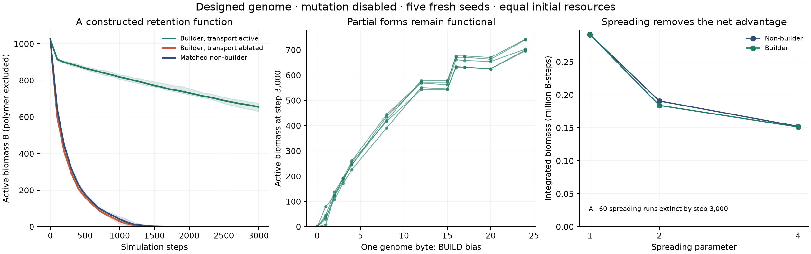
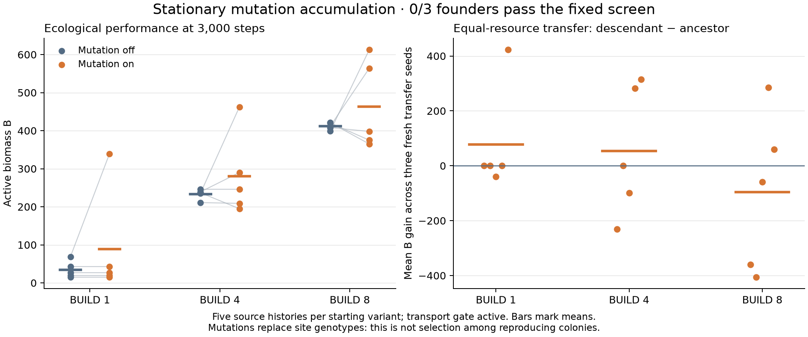

# A constructed resource-retention example

We now have a reproducible **stationary positive example**: a designed genome builds polymer from its own biomass and energy, retains locally recycled matter, and remains metabolically active when matched nonbuilders die. This is an experimental possibility result in a deliberately chosen habitat. It did not evolve, does not propagate, and has not demonstrated indefinite persistence.



The portable deliverable is [witness-v1.json](witness-v1.json): genome hex, complete configuration, exact initial placement/resources, horizon and validation seeds. The genome constructor is `tools/lib/construction.ts`. The example explicitly retains rule-1 physics. Its causal-control option, `polymerTransport:false`, provides the causal control: it removes P from A/C diffusivity while preserving construction expenditure, P decay and mechanical effects. Absent/true preserves every previous rule-1 trajectory and hash. A separate, optional rule-2 drag experiment is described in `DRAG-PROTOCOL.md`; it is not part of this positive witness.

## What the constructed function does

A 32×32 closed torus starts with one patch containing 1024 biomass and 2048 free energy; no nutrient, waste or polymer is gifted. Light supplies energy. Ordinary biomass turnover produces waste, decomposition recovers nutrient, and photosynthesis reuses it. Polymer slows escape from this local cycle. The genome senses P to stop overbuilding and E/B to regulate respiration.

The deliberate configuration uses gateK=1, B decay 500/65536, P decay 16/65536, no abiotic recycling, and uniform maximal light. dtQ=0 and spread=0 initially isolate chemistry. This habitat is unlike the default moving ecology; its purpose is to ask whether the existing construction mechanism can ever repay its cost.

Five validation seeds 101–105, all mutation disabled, horizon 3000:

| Arm | Active biomass at 3000, each seed | Mean integrated biomass |
|---|---|---:|
| Builder, transport effect active | 676,630,671,634,661 | 2,334,190 |
| Same builder, transport effect removed | 0,0,0,0,0 | 250,430 |
| Matched nonbuilder | 0,0,0,0,0 | 273,567 |
| Selected simple competitor | 0,0,0,0,0 | 274,109 |

Active biomass excludes polymer. Every arm has exactly equal initial matter and energy. The builder synthesized 106–124 polymer quanta over the assay, paying one B and two free-energy units per quantum, plus normal catalytic work/maintenance. The ablated builder also paid for its synthesis; its smaller eventual expenditure reflects early death, not a cost refund. The positive builder still declines from its initial 1024 B: the demonstrated function is longer persistence, not net biomass growth or immortal metabolism.

Exact pre-step directed diffusion accounting shows average net A+C escape 292.2 quanta for the builder versus 1023.4 for its matched nonbuilder. All sampled matter and energy residuals are exactly zero, and all runs recorded zero mutations. On/off nonbuilder controls are identical, as expected without P.

## Stronger competitors and return capture

The comparator search evaluated 103 disclosed nonbuilders: 90 constant/energy-feedback controllers, one generalist and 12 existing M3 founders with BUILD output disabled. Selection used seeds 1–2, final B followed by integrated B. All reached B0 at 3000. The selected best (`simple-p127-r0-d127-g64`) was then tested on101–105 and also reached zero in all five. This is the best of a stated search family, not a globally optimal competitor. [Selected genome and selection record](selected-competitor-v1.json).

Adding a nonbuilding neighbour at distances 1, 2, 4, and reflecting each layout, leaves the producer alive in all 30 mechanism-on cases (final B 642–708); each nonbuilder reaches zero. Mechanism-off paired worlds mostly collapse. This demonstrates return capture against nearby dissolved-resource competitors. Stationarity prevents replacement through movement, so it does **not** establish resistance to invading/mixing freeloaders. Mixed worlds start with twice the monoculture resources; only equal-resource mixed arms support causal comparison.

## Accessibility and the boundary of the result

The BUILD feedback wiring is identical even at bias 0. Bias 0→1 is a single legal controller-byte mutation; its five final biomass values are 46, 80, 31, 38, 8, with mean cumulative construction 10 quanta. Cheaper partial constructions thus remain functional. Tested bias 4, 8, 12, 16, 24 have mean final B 247, 422, 563, 654, 716; jumps along that sequence each alter one byte by at most 8, within the configured mutation step 24. These are accessible designed variants, not observed evolutionary substitutions.

The landscape is not smoothly improving: bias 15 is slightly worse than 12;17 and20 do not improve on 16. Integer permeability creates steps in the response, and a useful local path does not establish general evolvability.

Allowing spread 1, 2, 4 while leaving flow disabled kills every one of 60 runs. Mean integrated biomass for builder/nonbuilder is291318/291280,183924/190604,151261/152138 respectively. At 100-step observations, material briefly occupies 21–53 cells, then active biomass disappears while polymer can remain. The transport effect still often helps relative to the ablated builder, but no robust net advantage remains relative to the nonbuilder. This is **not** successful propagation.

The [physical-flow follow-up](MOVING.md) includes a failed fresh-seed extension after that failure. It varies only existing movement/adhesion settings and keeps all negative candidates. Its outcomes are recorded separately and are not pooled into the stationary confirmation. Future moving witnesses must separately establish cost repayment, causal transport benefit and return capture.

## Evidence and verification

[Compact observations](witness-v1-results.json) retain all 210 cases from core, selected-competitor confirmation, accessibility, neighbours and spreading. Complete traces, initial manifests, final checkpoints and hashes are in `runs/construction/`; the 103-comparator search and exploratory pilots are retained there too. The original comparator script lacked an output-reuse guard; its first run was unique, and a retrospective manifest/source snapshot labels that fact. Subsequent CLIs exclusively create a new output directory and record source SHA256 hashes at launch.

Verification completed for the initial stationary phase:

- 60 focused tests for configuration validation, transport accounting, retained construction cost, unchanged old hashes, matched starts and legal one-byte changes.
- TypeScript project check and Deno checks for the new tools.
- All 13 native WebGPU golden cases match CPU bit for bit, including the new transport ablation. All 12 preexisting golden pins remain unchanged.
- Independent full 3000-step replays of seed 101 builder/on and builder/off reproduce saved hashes `73bc0c362c9fa150` and `9a6a71532ca97d78` and exact conservation.
- Sol 6.1 High read-only review found an output-reuse/provenance issue; the CLI now refuses existing output directories and records manifests. The follow-up review closed all P1/P2 issues and verified all 210 compact records against raw summaries. Its one P3 numerical correction (nonbuilder mean escape 1023.4) is fixed.

Reproduce on a fresh output path:

```sh
deno run -A tools/construction-search.ts runs/construction/new-search
deno run -A tools/construction-witness.ts core runs/construction/new-core
deno run -A tools/construction-witness.ts access runs/construction/new-access
deno run -A tools/construction-witness.ts neighbours runs/construction/new-neighbours
deno run -A tools/construction-witness.ts spread runs/construction/new-spread
deno run -A tools/construction-witness.ts competitor runs/construction/new-competitor experiments/construction/selected-competitor-v1.json
deno run -A tools/construction-verify.ts runs/construction/core-v1/builder-on-seed-101.json
uv run --no-project --with matplotlib python tools/construction-plot.py
```

The dated amendment in `PROTOCOL.md` allowed a bounded stationary mutation/transport factorial and equal-resource transfer. It is now complete:60 source histories and108 unique transfer assays. Five of15 mutation-enabled/gate-enabled histories improved in both their original ecology and all three fresh transfer seeds, but they cluster in two seed blocks with strongly overlapping mutation events across founder backgrounds. They are not five independent discoveries; the fixed consistency criterion failed (0/3 founder variants qualify). One founder variant improved on average in its source worlds yet worsened on average after transfer. This is finite, genetically transferable improvement in some mutation-accumulation histories, not selection among reproducing patches. The conditional second opportunity was not earned or tested; no new ecological function is claimed. See [protocol](EVOLUTION.md), [results and dated reporting amendment](EVOLUTION-RESULTS.md) and [study status](STATUS.md).



The separate optional rule-2 drag experiment failed, with B0 in every arm at3000 and10000 ([results](DRAG-RESULTS.md)). Both negative extensions remain preserved. Existing presets and registered experiments retain rule1. Final implementation validation passed1894 tests and28 native CPU/GPU golden cases; scoped Sol6.1High reviews and independent data audits are recorded in `runs/construction/validation.json`.

The [2026-10-04 adversarial Fable review](FABLE-REVIEW.md) corrected the mutation-evidence framing, restored rule 1 as the configuration default, and made standard GPU checks cover both versions. Remediation passed all 1,894 tests and all 28 native and browser golden cases. The [next direction](NEXT-EXPERIMENT.md) is a bounded, unexecuted test of nutrient access and population renewal before adding transport physics.
